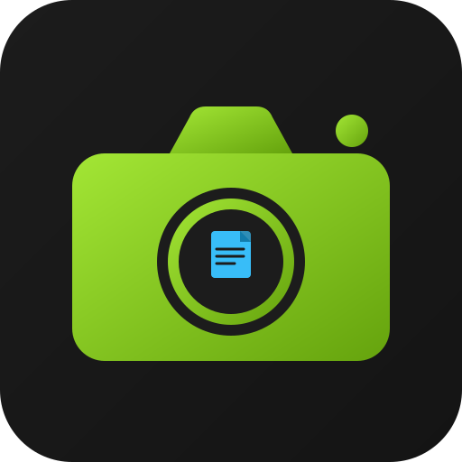

# Lume

<p align="center">
  
</p>

<p align="center">
  Screenshot → Text. Bildschirm aufnehmen oder Bild hochladen, OCR läuft lokal.
</p>

---

## Features

- Bildschirmbereich auswählen & aufnehmen
- Bild hochladen (PNG, JPG, ...)
- OCR mit Tesseract.js (Deutsch + Englisch, lokal, kein Server)
- Text kopieren

## Dev

```bash
npm install
npm run tauri dev
```

## Build

```bash
npm run tauri build
```

Output: `src-tauri/target/release/bundle/`

## Stack

- [Tauri 2](https://tauri.app) — native Shell
- [SvelteKit](https://kit.svelte.dev) — Frontend
- [Tesseract.js](https://tesseract.projectnaptha.com) — OCR Engine
- [shadcn-svelte](https://www.shadcn-svelte.com) — UI
