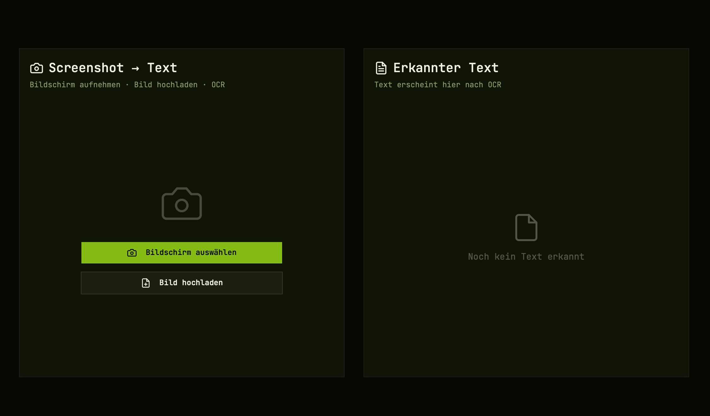

# Lume

Screenshot-to-text desktop app. Take a screenshot or upload an image, run OCR, copy the result.



## Features

- **Screen capture** — select any region of your screen (Tauri) or use browser screen share
- **Image upload** — drag in any image file
- **OCR** — extracts text via Tesseract.js (German + English out of the box)
- **Copy to clipboard** — one click

## Stack

| Layer | Tech |
|---|---|
| UI | SvelteKit 5 + shadcn-svelte + Tailwind CSS v4 |
| Desktop | Tauri v2 |
| OCR | Tesseract.js 7 |
| Font | JetBrains Mono |

## Getting started

```bash
cd Lume
npm install

# web dev server
npm run dev

# desktop app (requires Rust toolchain)
npm run tauri dev
```

## Build

```bash
# web
npm run build

# desktop binary
npm run tauri build
```

## Requirements

- Node.js 20+
- Rust + Cargo (for desktop build) — [rustup.rs](https://rustup.rs)

## License

MIT
